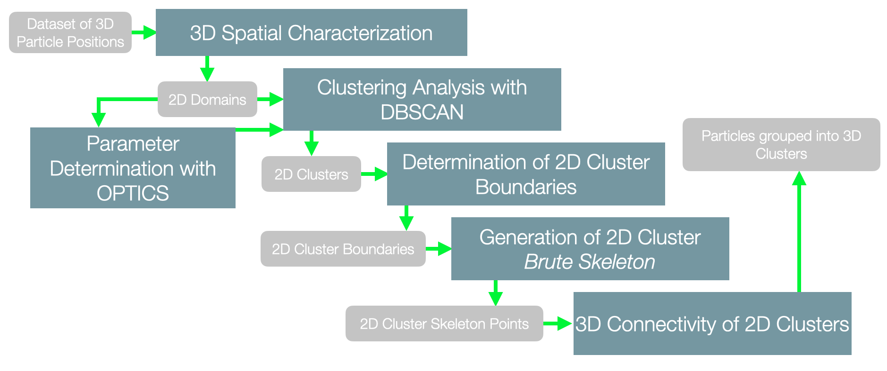
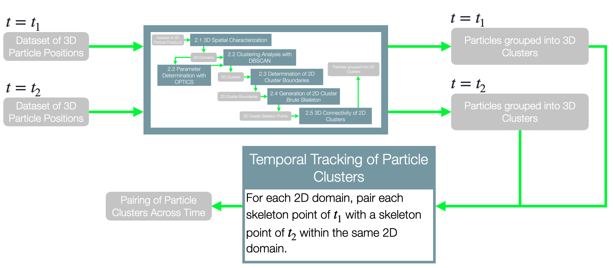
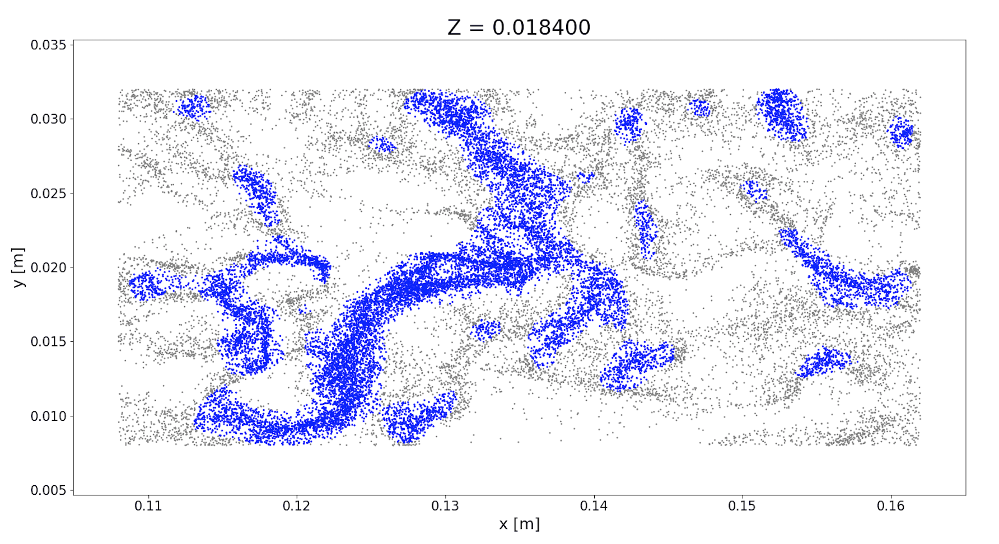
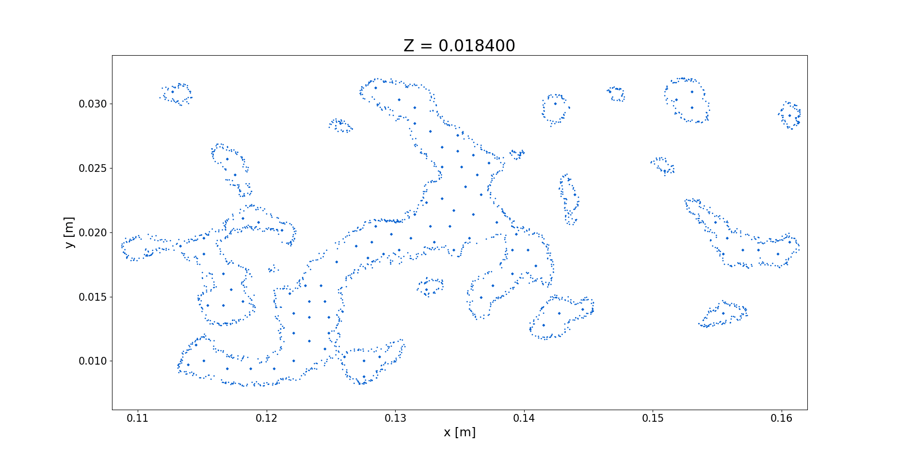
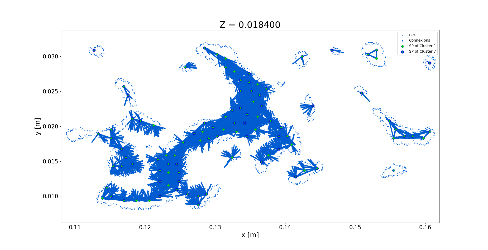
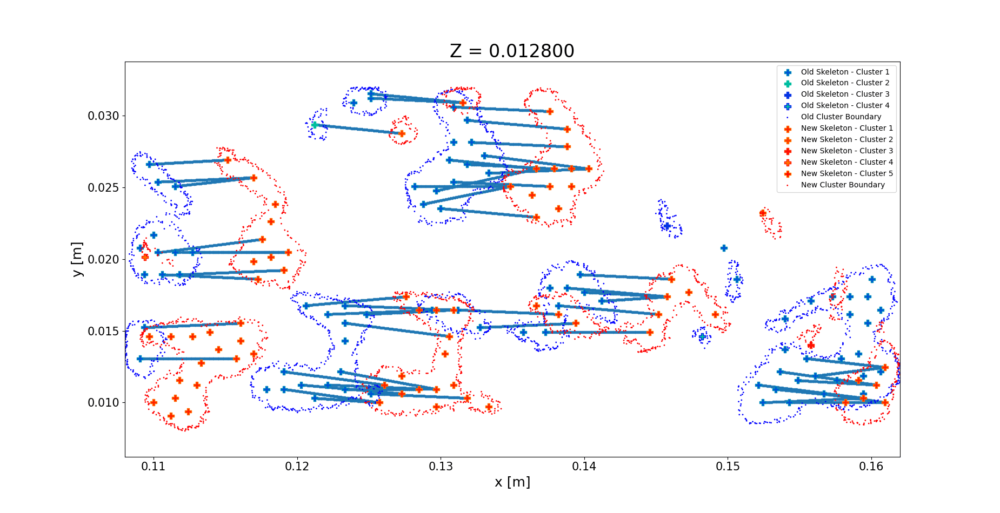

# Topological and temporal analysis of particle clusters in turbulent flows using density-based clustering algorithms

## Summary:
A novel method for the identification and temporal tracking of particle clusters in turbulent particle-laden flows is presented. It makes use of density-based clustering algorithms such as DBSCAN and OPTICS in order to discern regions of high particle concentrations, labeled as clusters, from those with lesser particles. The key features of the proposed methodology are its ability for identification and tracking of particle clusters in 3D and 2D, its robustness to particle number density, the absence of independent user defined parameters, and its computational efficiency for large data sets. The flexibility on the data dimensionality and in part the reduced computational cost are rooted on the treatment of 3D particle positions as multiple 2D projections into equidistant parallel planes. Clustering algorithms are used on each plane to identify clouds of particles conforming independent clusters, and the topology of each cluster is then condensed into boundary particles and a limited set of representative internal particles that define the 2D skeleton. This reduced set of particles is used to reconstruct 3D topologies and to track the cluster evolution in time at consecutive time steps. Cluster topologies are in good agreement with those obtained using more traditional Voronoi based analysis, with the new proposed method showing a significant reduction in computational cost. 

## Workflow:

For the analysis of a dataset concerning a single time instant, the workflow is as shown below:

Once several time instants have been processed, one can correlate adjacent time instants as follows:

## Some images of the process:

## Code Structure:
* **OpenSliceVTK.py:** This script simply loads a .VTK file containing three-dimensional particle positions, projects them into a specified number of planes of constant Z, and outputs the resulting projected positions into a .CSV file.
* **clusteringAnalysis.py:** For a single .CSV file containing projected particle positions obtained with OpenSliceVTK.py, this script invokes the necessary classes of other scripts in order to perform all of the steps involved in the identification of three-dimensional clusters parting from the simplified dataset. This script invokes clustering3D.py, boundaryFinder.py , eulerianApproach.py , clusterConnect.py , and relabeller.py.
* **clustering3D.py:** For a set of parallel two-dimensional domains containing projected particle positions, this script carries out the two-dimensional DBSCAN clustering analysis of each two-dimensional plane. In order to do so, it is also in charge of obtaining a set of parameters for DBSCAN which are adapted to the average number density of the domain. It can also command the visualization of the results. This script invokes OPTICS.py, DBSCAN.py, and clusterPlot.py.
* **OPTICS.py:** This script employs the clustering algorithm OPTICS in order to analyze the structure of a two-dimensional domain of projected positions, as well as to determine a set of parameters for DBSCAN which are adapted to the average number density of the domain. To visualize the results, this script invokes clusterPlot.py.
* **DBSCAN.py:** This script employs the clustering algorithm DBSCAN in order to analyze the structure of a two-dimensional domain of projected positions. To visualize the results, this script invokes clusterPlot.py.
* **clusterPlot.py:** Given a set of projected particle positions to which different cluster labels have been assigned, this script generates a .GIF file representing the clustering configuration of each two-dimensional domain.
* **boundaryFinder.py:** This script is in charge of determining closed curves defining the boundaries of two-dimensional clusters of projected particle positions, as the ones obtained with clustering3D.py. To visualize the results, this script invokes skeletonPlot.py.
* **skeletonPlot.py:** Given a set of closed curves defining two-dimensional cluster boundaries and skeleton points interior to each cluster, this script generates a .GIF file representing these elements within each two-dimensional domain.
* **eulerianApproach.py:** This script discretizes each two-dimensional domain by means of a regular grid, in order to calculate the area of each DBSCAN cluster generated by clustering3D.py, and also, for each two-dimensional cluster, determines a set of interior points defining its brute skeleton. To visualize the results, this script invokes clusterPlot.py and skeletonPlot.py.
* **clusterConnect.py:** Based on the cluster boundaries defined by boundaryFinder.py and the skeleton points generated in eulerianApproach.py for each two-dimensional cluster, this script examines the three-dimensional connectivity of skeleton points in order to come up with three-dimensional particle cluster labels. To visualize the results, this script invokes skeletonPlot.py.
* **relabeller.py:** This script is in charge of assigning the three-dimensional cluster labels obtained in clusterConnect.py to the corresponding projected particle positions, as well as of estimating the volume associated with each three-dimensional cluster. To visualize the results, this script invokes clusterPlot.py.
* **temporalTracking.py:** Here, for a pair of datasets corresponding to two adjacent instants of time, each of them analyzed via clusteringAnalysis.py, skeleton points are connected according to topological similarities, in order to connect three-dimensional clusters over time. Based on this, the temporal evolution of a cluster for several instants of time can be analyzed. To visualize the results, this script invokes temporalPlot.py.
* **temporalPlot.py:** Given a pair of datasets corresponding to two adjacent instants of time, each of them analyzed via clusteringAnalysis.py, this script generates a .GIF file which represents old and new cluster boundaries in the same two-dimensional domain, as well as the connections between skeleton points as per temporalTracking.py.
* **voronoiCluster.py:** This script is in charge of validating the results of clusteringAnalysis.py with an alternative clustering method based on the Voronoï tessellation of the same set of particle positions without having been projected into a number of planes of constant Z. To visualize the results, this script invokes voronoiPlot.py.
* **voronoiPlot.py:** Here, a .GIF file is generated that displays, for each two-dimensional domain in the dataset, a projection of Voronoï cluster cell centers as per voronoiCluster.py as well as skeleton points within the same plane of constant Z.
